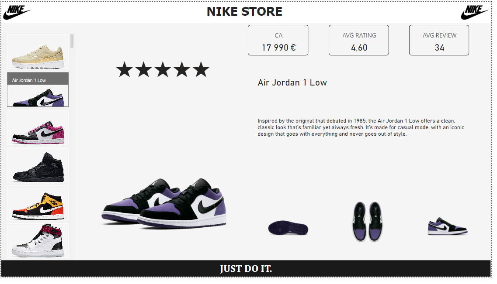
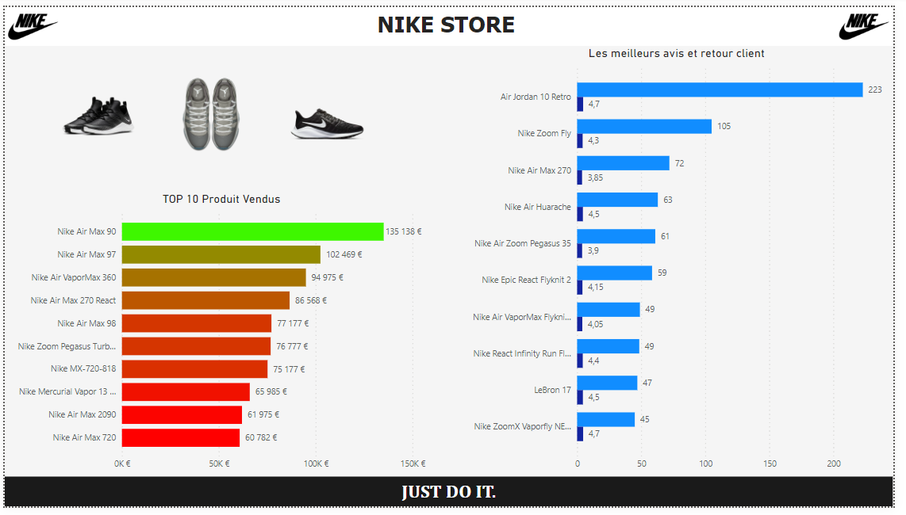

# Projet : Nike Store

## Catégorie
**Visualisation**

## Outils utilisés
**PowerBI**

## Année
**2023/2024**

## Project URL
*(à ajouter)*

## Détail de projet
NIKE Store offre un aperçu complet de ses performances, avec des analyses sur les ventes mensuelles, la répartition des ventes par produit, la rentabilité des produits, les données démographiques des clients, et la performance par magasin. Ce projet permet aux responsables de mieux comprendre les tendances de vente, d'identifier les produits les plus rentables, de cibler les segments de clients appropriés, et d'optimiser les opérations des magasins pour maximiser les revenus.

## Captures d'écran

